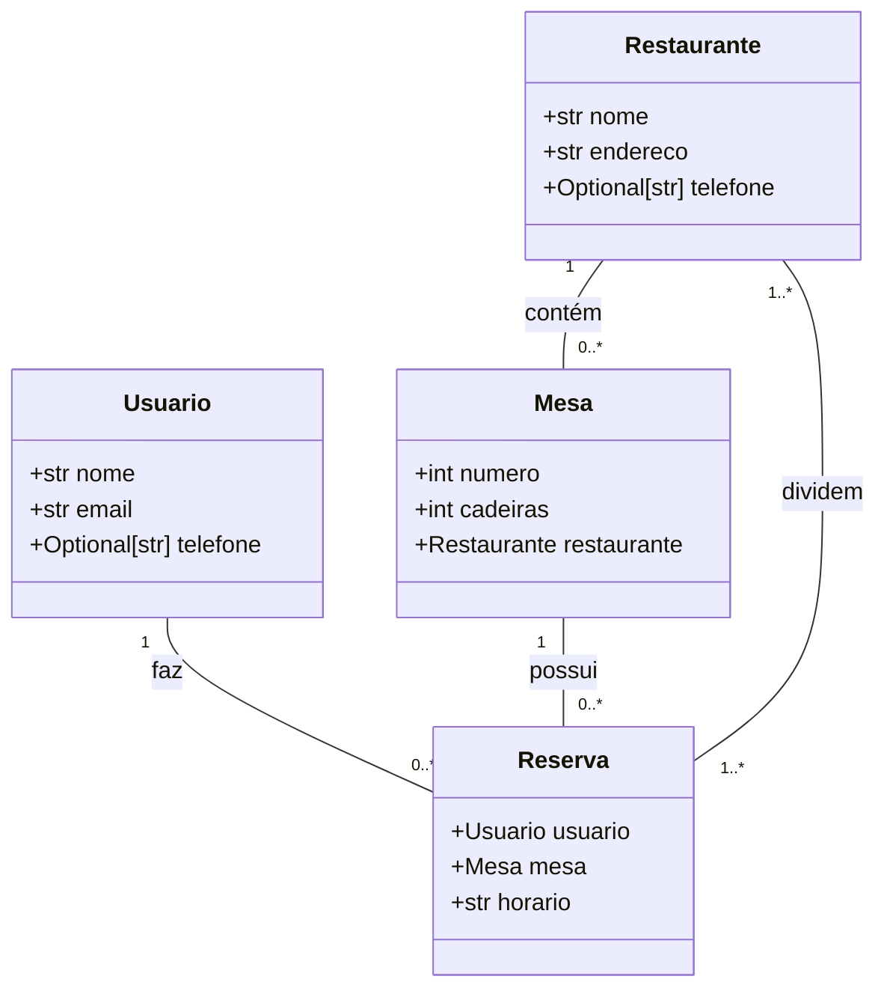

```mermaid
classDiagram
    class Usuario {
        +str nome
        +str email
        +Optional[str] telefone
    }

    class Restaurante {
        +str nome
        +str endereco
        +Optional[str] telefone
    }

    class Mesa {
        +int numero
        +int cadeiras
        +Restaurante restaurante
    }

    class Reserva {
        +Usuario usuario
        +Mesa mesa
        +str horario
    }

    Usuario "1" -- "0..*" Reserva : faz
    Mesa "1" -- "0..*" Reserva : possui
    Restaurante "1" -- "0..*" Mesa : contém
    Restaurante "1..*" -- "1..*" Reserva : dividem
```
